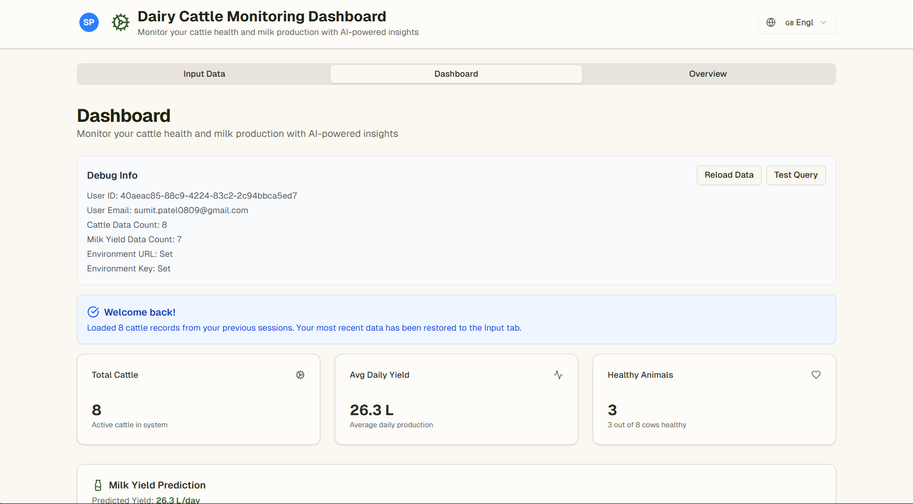
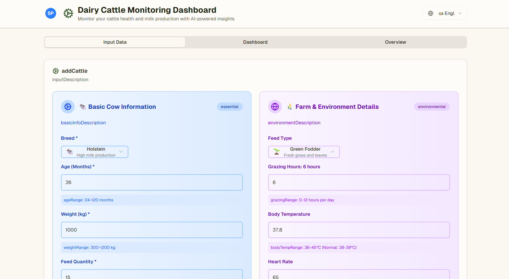
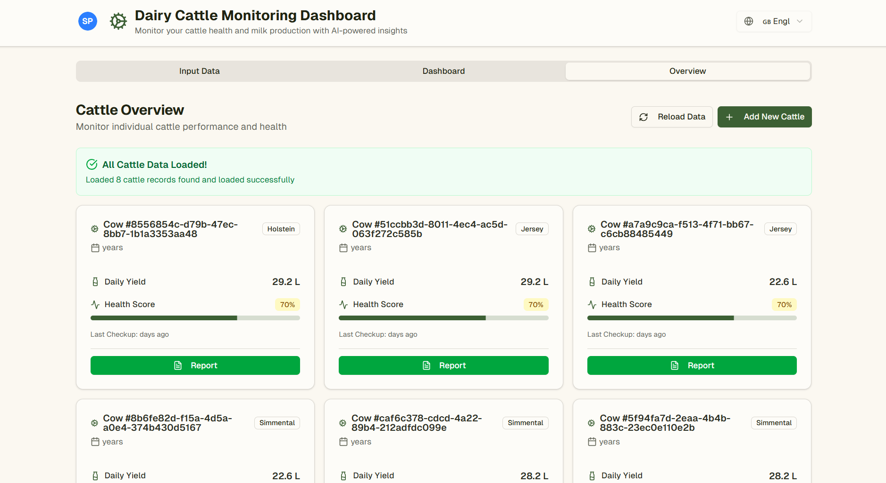
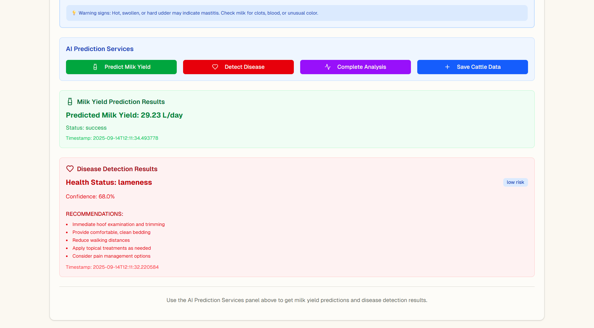
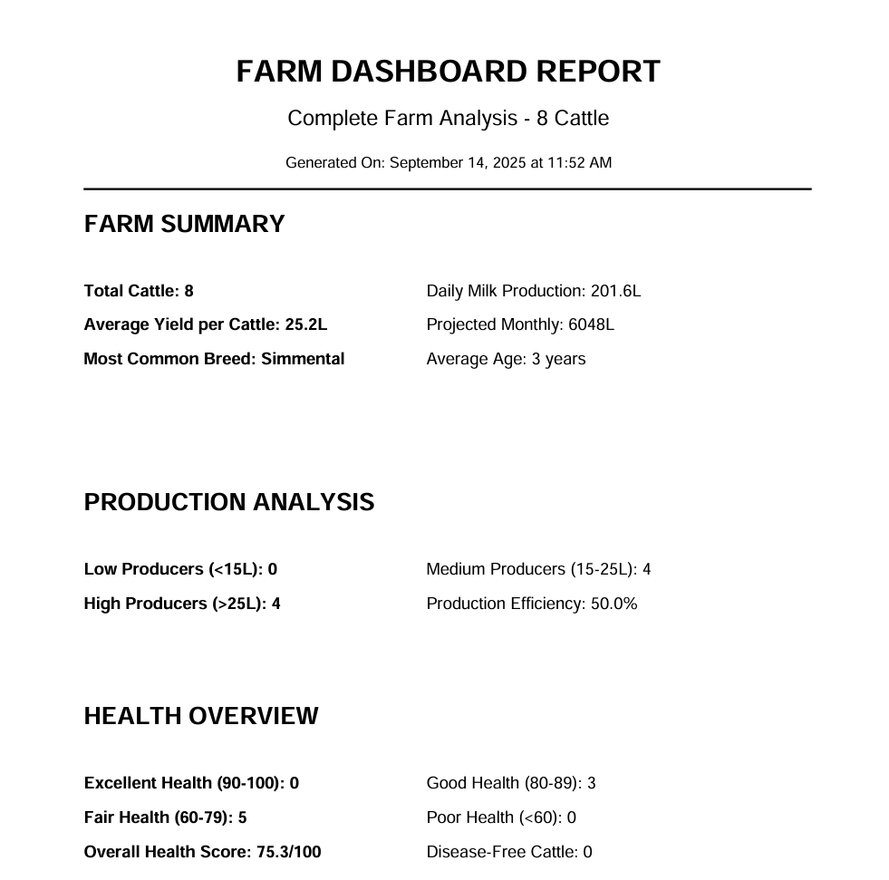

# 🐄 Cattle Health & Milk Predictions System

## 🏆 Hackovate Project - Team Hellboys

A comprehensive AI-powered platform for dairy cattle health monitoring and milk yield prediction, designed to revolutionize modern dairy farming through intelligent data analysis and predictive insights.

## 📋 Table of Contents

- [Overview](#overview)
- [Features](#features)
- [Technology Stack](#technology-stack)
- [Architecture](#architecture)
- [Installation](#installation)
- [Usage](#usage)
- [API Documentation](#api-documentation)
- [Screenshots](#screenshots)
- [Contributing](#contributing)
- [License](#license)

## 🌟 Overview

The Cattle Health & Milk Predictions System is an innovative solution that combines machine learning, real-time data processing, and modern web technologies to provide dairy farmers with actionable insights about their cattle's health and milk production potential.

### 🎯 Problem Statement

Traditional dairy farming relies heavily on manual observation and experience-based decisions, leading to:
- Delayed disease detection
- Suboptimal milk yield predictions
- Inefficient resource allocation
- Higher veterinary costs
- Reduced farm profitability

### 💡 Our Solution

Our AI-powered platform addresses these challenges by:
- **Predictive Health Analysis**: Early disease detection using ML algorithms
- **Milk Yield Forecasting**: Accurate daily milk production predictions
- **Real-time Monitoring**: Continuous health score tracking
- **Intelligent Recommendations**: Data-driven farming suggestions
- **Multi-language Support**: Accessible in English, Hindi, Gujarati, and Marathi

## ✨ Features

### 🤖 AI-Powered Predictions
- **Milk Yield Prediction**: Advanced regression models for accurate daily milk yield forecasting
- **Disease Detection**: Classification algorithms for early disease identification
- **Health Scoring**: Comprehensive health assessment based on multiple parameters

### 📊 Comprehensive Dashboard
- Real-time cattle health monitoring
- Interactive data visualizations with Recharts
- Farm-wide analytics and insights
- Individual cattle performance tracking

### 📱 Modern User Interface
- Responsive design with mobile support
- Intuitive cattle data management
- Enhanced UI with gradient backgrounds and animations
- Dark/light theme support

### 📄 Advanced Reporting
- PDF report generation for individual cattle
- Farm-wide summary reports
- AI-driven recommendations
- Exportable analytics

### 🌐 Multi-language Support
- English, Hindi, Gujarati, and Marathi translations
- Localized user experience
- Cultural adaptation for Indian dairy farmers

### 🔐 Secure Data Management
- User authentication with Supabase Auth
- Real-time database synchronization
- Secure data storage and retrieval

## 🛠 Technology Stack

### Frontend
- **Framework**: Next.js 14 with React 18
- **Language**: TypeScript
- **Styling**: Tailwind CSS
- **UI Components**: Shadcn/UI
- **Charts**: Recharts
- **PDF Generation**: jsPDF
- **State Management**: React Context API

### Backend
- **API Framework**: FastAPI (Python)
- **Server**: Uvicorn
- **ML Libraries**: Scikit-learn, Pandas, NumPy
- **Model Serialization**: Joblib

### Database & Authentication
- **Database**: Supabase (PostgreSQL)
- **Authentication**: Supabase Auth
- **Real-time**: Supabase Real-time subscriptions

### AI/ML Models
- **Model 1**: Milk Yield Prediction (Regression)
- **Model 2**: Disease Detection (Classification)
- **Training Data**: Comprehensive cattle health and production datasets

## 🏗 Architecture

```
┌─────────────────┐    ┌─────────────────┐    ┌─────────────────┐
│   Frontend      │    │   Backend API   │    │   Database      │
│   (Next.js)     │◄──►│   (FastAPI)     │◄──►│   (Supabase)    │
│   Port: 3000    │    │   Port: 8000/1  │    │   PostgreSQL    │
└─────────────────┘    └─────────────────┘    └─────────────────┘
         │                       │                       │
         │              ┌─────────────────┐              │
         │              │   ML Models     │              │
         └──────────────►│   - Model 1     │◄─────────────┘
                        │   - Model 2     │
                        └─────────────────┘
```

### Service Architecture
- **Model 1 (Port 8000)**: Milk yield prediction using regression algorithms
- **Model 2 (Port 8001)**: Disease detection using classification algorithms
- **Frontend (Port 3000)**: Modern React application with enhanced UI/UX
- **Database**: Supabase for data persistence and user management


### Accessing the Application
- **Frontend**: http://localhost:3000
- **Model 1 API**: http://localhost:8000
- **Model 2 API**: http://localhost:8001

### Using the Platform

1. **Sign Up/Login**: Create an account or login with existing credentials
2. **Add Cattle Data**: Input cattle information in the Input tab
3. **Run Predictions**: Generate AI predictions for milk yield and disease detection
4. **View Dashboard**: Monitor real-time cattle health and production metrics
5. **Generate Reports**: Create comprehensive PDF reports for individual cattle or farm overview

## 📚 API Documentation

### Model 1 - Milk Yield Prediction
```http
POST /predict-milk-yield
Content-Type: application/json

{
  "breed": "Holstein",
  "age_months": 36,
  "weight_kg": 550,
  "feed_type": "Mixed",
  "feed_quantity_kg": 25,
  "grazing_hours": 8,
  "body_temperature": 38.5,
  "heart_rate": 70,
  "temperature": 25,
  "humidity": 60
}
```

### Model 2 - Disease Detection
```http
POST /predict-disease
Content-Type: application/json

{
  "white_blood_cells": 7500,
  "somatic_cell_count": 200000,
  "rumen_ph": 6.2,
  "rumen_temperature": 39.0,
  "lameness_score": 1,
  "appetite_score": 4,
  "coat_condition": 4,
  "udder_swelling": 0
}
```

### Response Format
```json
{
  "prediction": "value",
  "confidence": 0.95,
  "recommendations": ["recommendation1", "recommendation2"],
  "status": "success"
}
```

## 📸 Screenshots

### Dashboard Overview


### Data Input


### Cattle Management


### AI Predictions


### Report Generation



## 🤝 Contributing

We welcome contributions to improve the Cattle Health & Milk Predictions System!


### Code Standards
- Follow TypeScript/JavaScript best practices
- Use Tailwind CSS for styling
- Write comprehensive tests
- Document new features

## 👥 Team Hellboys

- **Project Lead**: Buha Aryan
- **AI/ML Engineer**: Prajapati Neel
- **Frontend Developer**: Patel Vrund
- **Backend Developer**: Patel Sumit

## 🙏 Acknowledgments

- Hackovate organizers for the opportunity
- Open source community for amazing tools and libraries
- Dairy farming experts for domain knowledge
- Beta testers and early adopters

## 📞 Support

For support, email us at [your-email] or create an issue in this repository.

---

**Made with ❤️ for the future of dairy farming**
